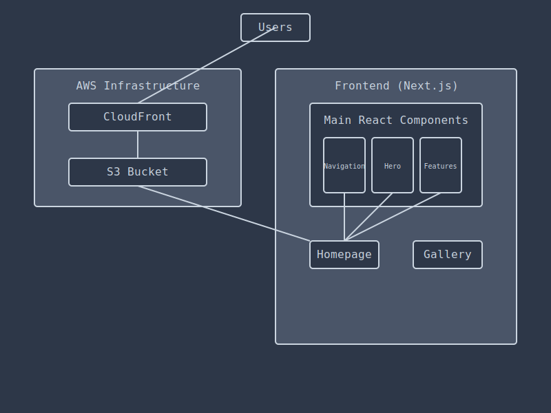

# CogniscentAI Architecture

## Overview
This document provides a detailed view of the CogniscentAI website architecture.

## Infrastructure Diagram

## Components

### AWS Infrastructure
- **CloudFront**: Our CDN that delivers content globally with low latency
- **S3 Bucket**: Stores all static website content (HTML, CSS, JS, images)

### Frontend (Next.js)
- **Pages**: Homepage, Gallery, Blog, About
- **Main Components**:
  - Navigation: Site-wide navigation bar
  - Hero Section: Featured content area
  - Features: Highlights of key functionality

## Flow
1. Users access the website through CloudFront
2. CloudFront retrieves content from S3
3. The Next.js frontend renders the appropriate page
4. React components compose the user interface

## Deployment
- Code is stored in GitHub
- GitHub Actions automate deployment
- Changes are pushed to S3
- CloudFront distributes updates globally